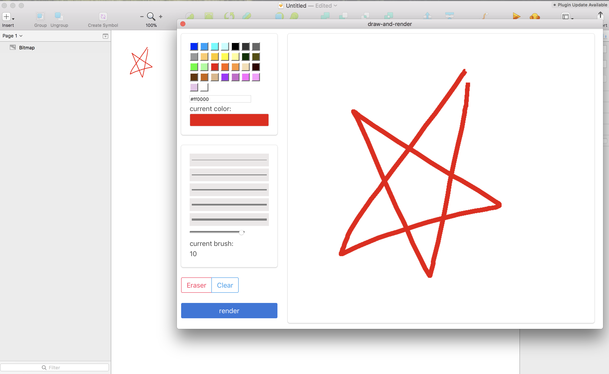

# draw-and-render

> draw on a canvas and render into sketch

## Installation

### From a release (simplest)

* [Download](https://github.com/nichenqin/draw-and-render-sketch-plugin/releases/latest) the latest release of the plugin
* Un-zip
* Double-click on draw-and-render.sketchplugin

### From the sources

* Clone the repo
* Install the dependencies (`npm install`)
* Double-click on draw-and-render.sketchplugin

## TODO

* [ ] choose rendered layer size

* [ ] specify background color
